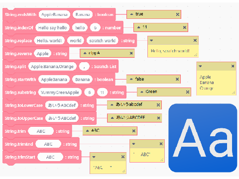

# Simple String Library v1.0

## Interactions

> [!WARNING]
> replace uses indexOf and substring
> trim uses trimStart and trimEnd

ex) methodName(arg: type): returnType
例) 定義名(引数: 型): 戻り値の型

- endsWith(target: string, suffix: string): boolean
- indexOf(target: string, str: string, fromIndex?: number): number
- replace(target: string, oldString: string, newString: String): string
- reverse(target: string): string
- split(target: string, delimiter: string): Scratch List
- split(target: string): Scratch List
- startWith(target: string, prefix: string): boolean
- substring(target: string, beginIndex: number, endIndex?: number): string
- toLowerCase(target: string): string
- toUpperCase(target: string): string
- trim(target: string): string
- trimEnd(target: string): string
- trimStart(target: string): string

## Descriptions

Scratchに足りない文字列操作メソッドを持ってきた、といった感じの定義集

### バックパックの使い方 / How to use the backpack.
English: https://en.scratch-wiki.info/wiki/Backpack
日本語: https://ja.scratch-wiki.info/w/index.php?curid=1411

### アップデート履歴
v1.0 2026/08/12 公開

この欄マークダウン使えるようにしてほしい
