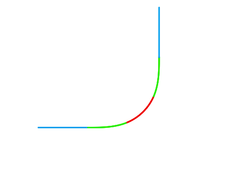

# 緩和曲線付き曲線を描くマン

## Interactions

マウスでドラッグして移動して、どうぞ

直線から緩和曲線への長さ：緑色の線の長さ(qキーで数値入力)
円曲線の半径：赤色の線の半径(aキーで数値入力)
緩和曲線から円曲線への長さ：赤色の線の長さ(zキーで数値入力)

緩和曲線の長さは80くらい、円曲線の半径はだいぶ余裕をもって円曲線の長さを変えるのがいいです
最終的な向きが0になるように調整すれば緩和曲線付き90°カーブが作れます

## Descriptions

マイクラ建築でリアリティのある鉄道と道路を作るために作成
自分が過去に作ったスプライトを持ってきて、修正するだけで作れたのでだいぶ手抜きですね。
